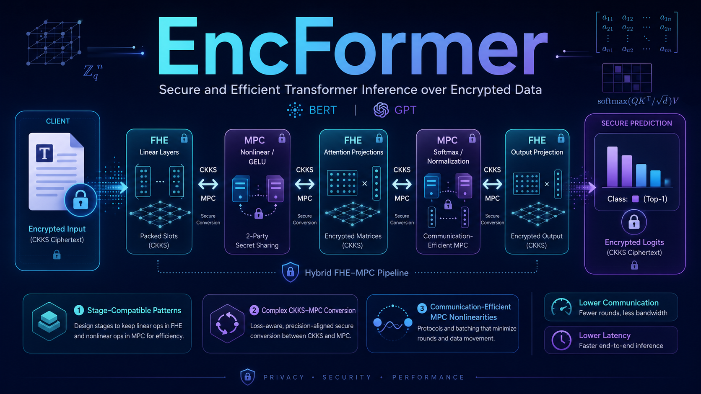

# EncFormer


[](LICENSE)



Official implementation of **EncFormer: Secure and Efficient Transformer Inference over Encrypted Data**, IEEE Transactions on Dependable and Secure Computing.

## Requirements

- Ubuntu 22.04
- Python 3.10
- CUDA 12.1
- GCC 11
- NVIDIA GPU with compute capability 7.0+ and 24 GB+ memory

## Setup

```bash
sudo apt-get update
sudo apt-get install -y build-essential cmake libgmp-dev libssl-dev libomp-dev python3.10 python3.10-venv python3-pip zip
python3.10 -m venv .venv
source .venv/bin/activate
pip install --index-url https://download.pytorch.org/whl/cu121 torch==2.5.1
pip install -r requirements.txt
```

## Build

```bash
bash scripts/build.sh 70
```

Use `80` for A100, `86` for RTX 30, or `89` for RTX 40.

## Run

```bash
sha256sum -c CHECKSUMS.sha256
python scripts/check.py
python scripts/eval.py --quick --gpu 0
python scripts/eval.py --full --gpu 0
python scripts/demo.py --idx 40 --gpu 0
bash scripts/2pc.sh 40 12 0
```

## Docker

```bash
docker build -t encformer .
docker run --rm --gpus all encformer --idx 40 --gpu 0
```

## Package

```bash
bash scripts/package.sh release
```

This creates `release/EncFormer-v1.0.0.zip` and its SHA-256 file. Use `assets/EncFormer-Profile.png` as the repository social preview and record image.

## Structure

```text
assets/                    EncFormer visual identity
checkpoints/               BERT-base SST-2 checkpoint
data/                      local tokenizer and SST-2 validation set
scripts/                   build, validation, evaluation, packaging
src/                       EncFormer runtime
tests/                     validation suite
third_party/phantom-fhe/   GPU CKKS source
third_party/ezpc-sci/      native two-party bindings
third_party/ezpc/SCI/      SCI, SEAL, and Eigen source
```

## License

EncFormer is released under the MIT License. Vendored dependencies retain their original licenses.
